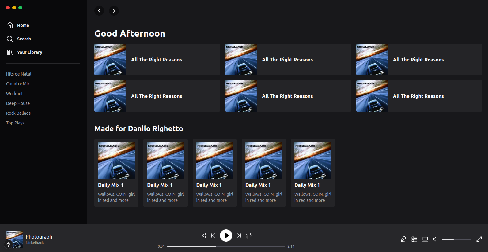

# Recriando a interface do Spotify usando Tailwind

Nesse projeto será recriada a interface do [Spotify](https://open.spotify.com/intl-pt) usando [Tailwind](https://tailwindui.com/documentation) com [Next](https://nextjs.org/), Vuejs e React.

<p align="center"></p>

## Requisitos

Ser o mais fiel possível a interface do [Spotify](https://open.spotify.com/intl-pt).

## Iniciando o projeto com Docker

**Atenção**: verifique se o **Docker** e o **Docker Compose** estão instalado no seu ambiente antes de executar os comando á seguir!

Antes de subir o projeto com todos os serviços necessários para o seu correto funcionamento, execute o comando para construir as imagens:

```bash
docker-compose build --no-cache
```

Em seguida, execute o comando abaixo para subir todos os serviços necessários:

```
docker-compose up -d
```

Após isso acesse [http://localhost:3000](http://localhost:3000).

## Instalação sem o Docker

Para iniciar o projeto execute os comando abaixo: 

```bash
  npm install #para instalar as dependencias do projeto
  npm run dev #para subir o projeto na porta 3000
```

Após a execução dos dois comando acesse [http://localhost:3000](http://localhost:3000).

## Documentação

O projeto foi criado para aprimorar os conceitos do [Nextjs](https://nextjs.org/) e do [Tailwind](https://tailwindui.com/documentation) através desse projeto.

## TODO

- Componentizar tudo o que foi desenvolvido até o momento.

## Stack utilizada

- **[Nextjs](https://nextjs.org/)** - (Versão 15.0.3 - Turbopack)
- **[Tailwind](https://tailwindui.com/documentation)**
- **[PNPM](https://pnpm.io/pt/)**
- **[Lucide](https://lucide.dev/)** - (Biblioteca de Icones)

## Autores

- [Github - @danilo-righetto](https://github.com/danilo-righetto)
- [Linkedin - @danilo-righetto](https://www.linkedin.com/in/danilo-righetto/)

## Fonte

- [Rocketseat - Recriando a interface do Spotify usando Tailwind](https://youtu.be/YVI-q3idGiM?si=ViqWETlzvTSy4c0D).

## Licença

Esta aplicação é um software de código aberto licenciado pelo [MIT license](https://opensource.org/licenses/MIT).